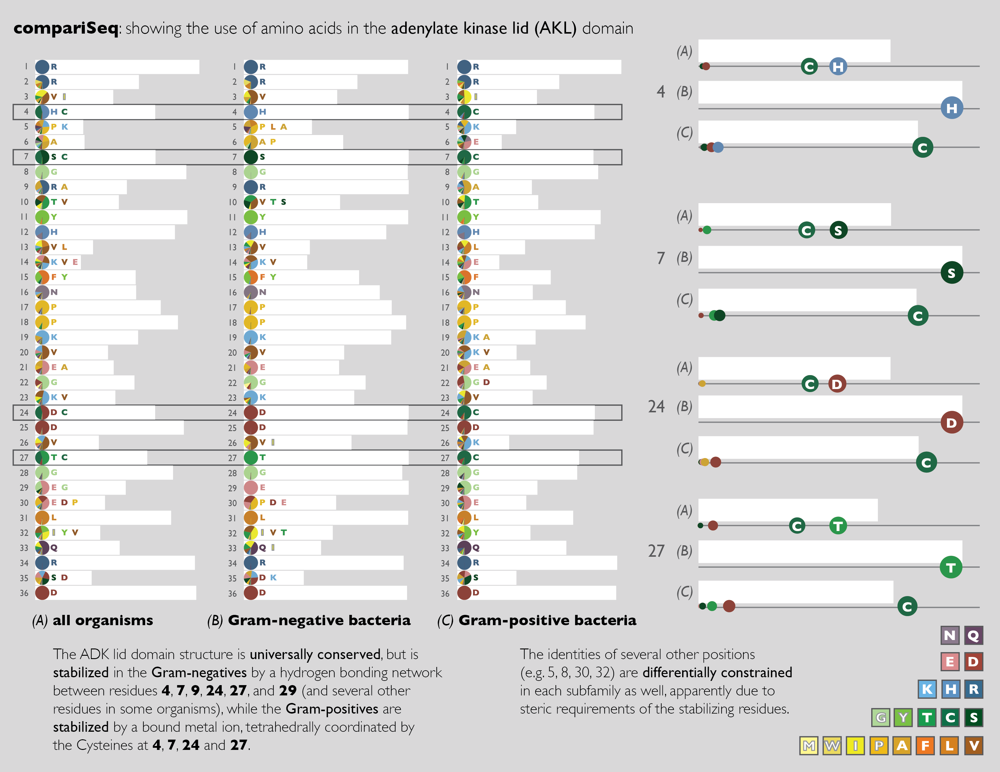

# compariSeq

_By: Sean McKenna, Alex Bigelow, P. Samuel Quinan_

Sequence logos are one of the most common methods to display biological
sequences. Accurately comparing residue frequencies using sequence logos,
however, is extremely difficult due to the combination and vertical stacking and
scaling relative to information content. Using observations garnered from
informal interviews with biologists of varying expertise, our proposed redesign,
**compariSeq**, was specifically formulated to better support such comparison
tasks.

## Installation

This tool is a prototype written for the [Processing](https://processing.org)
library, and you will have to download the Processing application and open the
code in `compariSeq/compariSeq.pde` and hit play to run the tool. It is provided
as-is, and we have included the data from the redesign contest as an example of
the required data input. You will likely want to replace this data with your
own, which are the three text files in `compariSeq/data`. It will read these
sequences and parse the data for visualization.

Please note that aspects such as screen size and how many items to display may
be limited due to how the code was written. Once inside the tool, you can left
or right click on the left to open up a detail view, and hovering over the
provided legend will highlight the corresponding amino acid. You can also hit
the key `p` at any time to output a PDF screenshot of the tool.

## Prototype Overview

The main view of compariSeq shows the full sequence, allowing users to see
general trends and locate interesting features. We vertically orient the
sequences, allowing multiple sequences to be compared while simultaneously. At
each location the bar length encodes conservation, the pie chart encodes
relative frequencies of all amino acids, and the most common amino acids are
also listed left to right.

We also provide a linked view that provides a direct comparison of frequency
information across sequences for selected locations. Relative frequencies are
encoded though the position along a common axis, while size simultaneously
denotes conservation.

## Design Justification

We identified the comparison of specific locations across sequences as a primary
task, observing that domain knowledge, coupled with conservation and approximate
frequencies, is enough to determine which locations are most interesting. As
such, we made conservation the most salient feature in our design, encoding it
in a bar chart to enable users to quickly cue into locations of interest. Once
interesting locations have been identified, users came more about frequency
comparison. The pie charts and detail views enable such comparisons while our
overview also provides explicit access to 'consensus' through a vertical scan.

## Acknowledgements

We would especially like to thank Heidi Schubert, Matthew Sdano, Venkatesh
Rajamanikkam, and Miriah Meyer for the information and feedback they provided on
our design.
